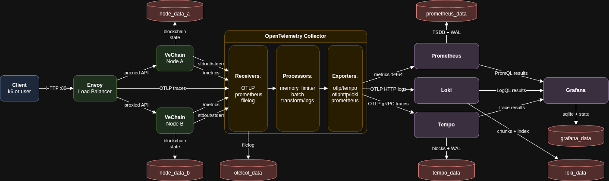
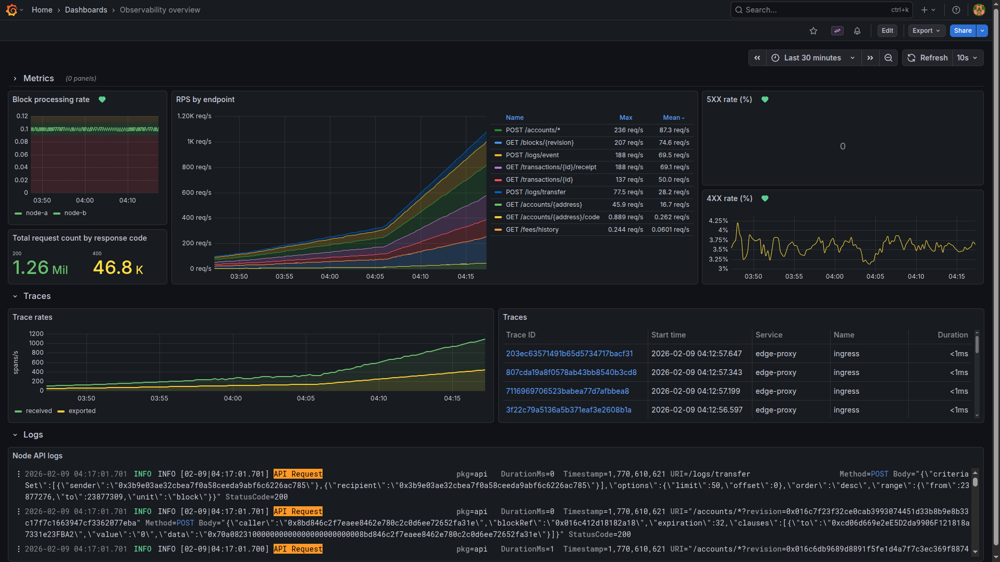

# Chainlink Labs Take Home Project

- [Chainlink Labs Take Home Project](#chainlink-labs-take-home-project)
  - [Design document](#design-document)
  - [Quick Start](#quick-start)
    - [Prerequisites](#prerequisites)
    - [Optional: Download and use a public snapshot](#optional-download-and-use-a-public-snapshot)
    - [Start the stack](#start-the-stack)
    - [Access endpoints](#access-endpoints)
    - [Generate synthetic traffic with k6](#generate-synthetic-traffic-with-k6)
    - [Validate telemetry flow](#validate-telemetry-flow)
    - [Stop and clean up](#stop-and-clean-up)

## Design document

For a deep dive into the design and architecture, please refer to the
[Design document](docs/design-document.md). There you will find:

- Executive summary.
- Problem statement and project prompt.
- Assumptions and constraints.
- System architecture and dataflow diagrams.
- Persistence and storage design.
- Observability setup (dashboards and alerts).
- Deploy, test, and validation workflow.
- Troubleshooting runbook.
- Design trade-offs and known gaps.
- Operational commands quick reference.

Context Diagram:



Observability Overview Dashboard:



## Quick Start

If you want to TL;DR; the [design document](docs/design-document.md), you can follow the quick start
guide below.

### Prerequisites

- Docker compose
- Docker environment with at least:
  - 8 vCPUs
  - 16 GB of RAM
  - 10 GB of disk space (up to 300 GB are needed, if you want to sync the testnet nodes fully)

### Optional: Download and use a public snapshot

Synchronizing the testnet nodes over the P2P network takes days. Luckily, you do not need to fully
sync the testnet nodes in order to run this project, but you should expect higher 4XX response codes
and unhealthy node signals until your nodes are fully synced.

If you want to speed up the sync process from days to minutes, you can download a public snapshot
from [here](https://snapshots.vechainlabs.io/node-hosting-testnet.tar.zst) (~48 GB compressed, ~100
GB uncompressed). Extract into `/storage/prd-node-snapshots/node-hosting/testnet` or set
`SNAPSHOT_PATH` to the correct path.

### Start the stack

```bash
docker compose up
```

### Access endpoints

- Grafana: http://localhost:3000 (admin/admin)
- Public VeChain API (Envoy): http://localhost:80
- Prometheus: http://localhost:9090
- Loki: http://localhost:3100
- Tempo: http://localhost:3200

### Generate synthetic traffic with k6

Run a quick smoke test:

```bash
./scripts/run-smoke-test.sh
```

Optional: other test profiles are available:

```bash
# Soak test: 1,000 VUs for 1 hour - slowly ramp up to a large number of users
./scripts/run-soak-test.sh

# Saturation test: 5,000 VUs for 2 minutes, consumes all your resources and makes your fans go crazy
./scripts/run-saturation-test.sh
```

### Validate telemetry flow

1. Grafana
   1. Dashboards: http://localhost:3000/dashboards
   2. Metrics, traces and logs are available in the
      [Observability overview](http://localhost:3000/d/5157ff4c-70fb-4b84-b0d5-21b6b1c36864/observability-overview)
2. Prometheus targets: http://localhost:9090/targets
   - Expect `otel-collector-metrics` and `prometheus` targets to be up.
3. Tempo: http://localhost:3200/api/search?q={resource.service.name}

### Stop and clean up

```bash
docker compose down
```

**Purge all networks, containers, images and volumes (use with caution):**

```bash
./scripts/purge-docker.sh
```
