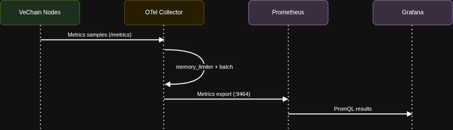
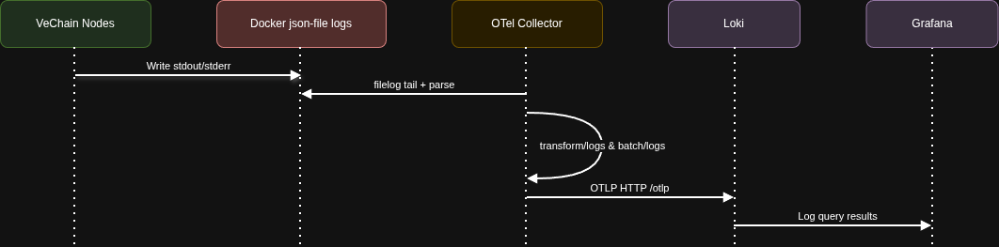
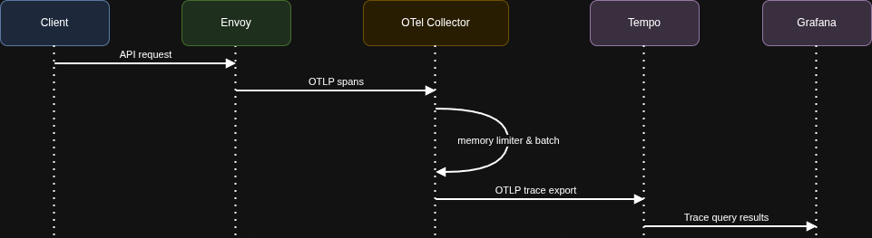
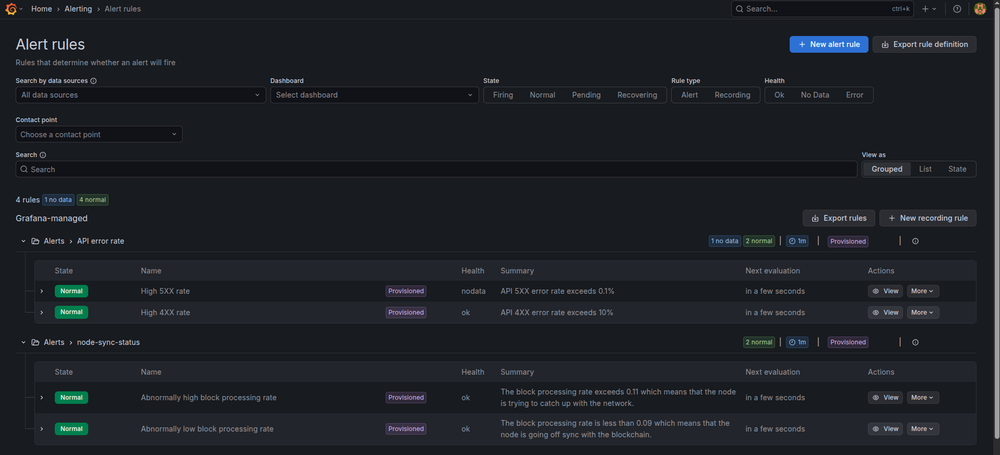
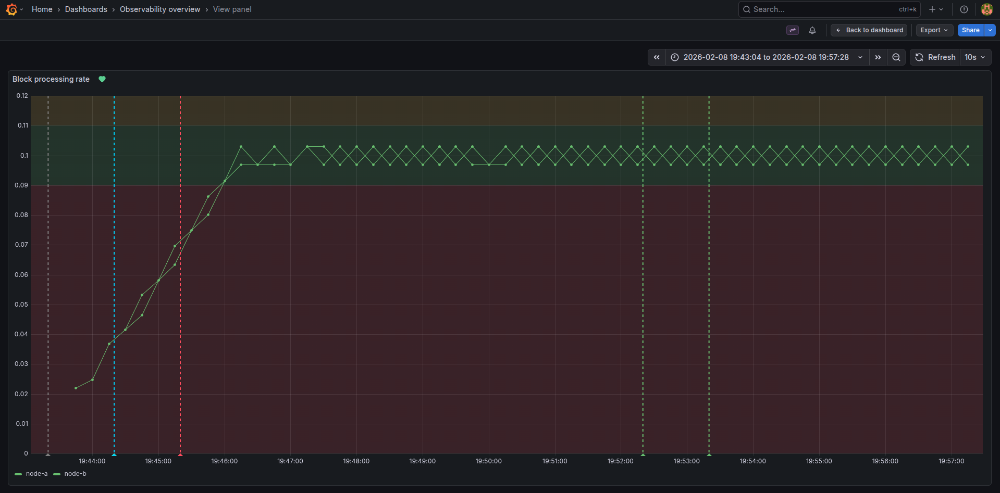

# Local End-to-End Observability Pipeline

- [Local End-to-End Observability Pipeline](#local-end-to-end-observability-pipeline)
  - [1. Problem Statement](#1-problem-statement)
    - [1.1 Introduction](#11-introduction)
    - [1.2 Project Prompt](#12-project-prompt)
  - [2. Assumptions and Constraints](#2-assumptions-and-constraints)
    - [2.1 Assumptions](#21-assumptions)
    - [2.2 Constraints](#22-constraints)
  - [3. System Architecture](#3-system-architecture)
    - [3.1 High-Level Architecture](#31-high-level-architecture)
    - [3.2 Dataflow Diagrams](#32-dataflow-diagrams)
      - [3.2.1 Context Diagram](#321-context-diagram)
      - [3.2.2 Metrics Sequence Diagram](#322-metrics-sequence-diagram)
      - [3.2.3 Logs Sequence Diagram](#323-logs-sequence-diagram)
      - [3.2.4 Traces Sequence Diagram](#324-traces-sequence-diagram)
    - [3.3 Network and Security Exposure Model](#33-network-and-security-exposure-model)
  - [4. Persistence and Storage Design](#4-persistence-and-storage-design)
    - [4.1 Named Volumes and Data Paths](#41-named-volumes-and-data-paths)
    - [4.2 Retention and Data Lifecycle](#42-retention-and-data-lifecycle)
  - [5. Observability](#5-observability)
    - [5.1 Dashboards and Data Source Provisioning](#51-dashboards-and-data-source-provisioning)
    - [5.2 Alerting Strategy](#52-alerting-strategy)
  - [6. Deploy, Test and Validate](#6-deploy-test-and-validate)
    - [6.1 Deploy](#61-deploy)
      - [6.1.1 Prerequisites](#611-prerequisites)
      - [6.1.2 (Optional) Download and use a public snapshot](#612-optional-download-and-use-a-public-snapshot)
      - [6.1.3 Deploy](#613-deploy)
    - [6.2 Test with k6](#62-test-with-k6)
      - [6.2.1 Smoke Test](#621-smoke-test)
      - [6.2.2 Soak Test](#622-soak-test)
      - [6.2.3 Saturation Test](#623-saturation-test)
  - [7. Troubleshooting](#7-troubleshooting)
    - [7.1 Container/runtime view](#71-containerruntime-view)
    - [7.2 Node health](#72-node-health)
    - [7.3 API accessibility](#73-api-accessibility)
    - [7.4 Trace readiness](#74-trace-readiness)
    - [7.5 Prometheus target status page](#75-prometheus-target-status-page)
    - [7.6 Inspect OTel collector logs for dropped telemetry or exporter retry pressure](#76-inspect-otel-collector-logs-for-dropped-telemetry-or-exporter-retry-pressure)
  - [8. Design Trade-offs and Gaps](#8-design-trade-offs-and-gaps)
    - [8.1 Design Trade-offs](#81-design-trade-offs)
    - [8.2 Known Gaps in Current PoC](#82-known-gaps-in-current-poc)
  - [9. Operational Commands (Runbook Quick Reference)](#9-operational-commands-runbook-quick-reference)

## 1. Problem Statement

### 1.1 Introduction

Site Reliability Engineer, Observability - Take Home Project

_During the exercise:_

- If you have any questions, please reach out to your recruiter directly.
- Typically, the project can be completed within 4-6 hours.

_Submitting the exercise:_

- At Chainlink Labs, we present and communicate through Google documents. Please deliver your
  project in document/memo format unless otherwise asked.
- Submit your project directly to your recruiter and coordinator within 7 days of receiving this
  brief. Sharing as a PDF or .doc. Do not submit slides/decks.

_Next steps:_

- We will invite you to present your project to some of the interviewers you have already met. This
  is a 45-minute session; 30 minutes for presenting and 10-15 minutes for Q&A. Youʼre welcome to
  invite questions and discussion throughout; we want to understand your thinking. Weʼre not judging
  your presentation skills.

_Task notes:_

- You wonʼt have all the context you need on how we work to complete this task to the highest levels
  of realism. Be creative and use assumptions about what we do. To help us understand your
  submission, share those assumptions with us.
- Itʼs fine if youʼre not sure about our current priorities; conjecture is OK.
- We operate in a low-information environment, so youʼll need to use your best judgment on what
  might be an interesting response to this task. We want to understand your ideas and approach,
  which is more important than trying to find a perfect outcome.
- Please do not share or publish this exercise brief or your final work publicly.

### 1.2 Project Prompt

**Topic:** Designing an End-to-End Observability Pipeline (Metrics, Logs, Traces)

**Goal:** We’re looking to understand how you would design a complete local observability pipeline
that ingests and stores metrics, logs, and traces from applications. Your solution should reflect
strong judgment in system architecture, tooling, and operational best practices.

**Task:** Propose and document an approach for building an observability stack that operates
entirely on your local machine. You may select any architecture, tools, or strategies you believe
are appropriate to ensure reliability, repeatability, and operability.

**Requirements:**

- You define the architecture, tools, and observability signals.
- Use a local Kubernetes environment, if possible.
- Ensure data is persisted locally using Kubernetes PersistentVolumes.
- The system should be able to receive telemetry via OTLP, including: Metrics scraping (e.g.,
  Prometheus pull model)
- Define three logical pipelines: one each for metrics, logs, and traces.
- Include dataflow diagrams (context + sequence) showing how telemetry flows through your system.
- Demonstrate basic internal operability signals of your choice (e.g., health checks, alerting,
  dashboards, service logs).

**Optional (Bonus):** You’re welcome to include a basic proof-of-concept setup, with example
configuration or sample apps to demonstrate your design. This is not required, but appreciated.

## 2. Assumptions and Constraints

The project prompt is explicit about building an observability stack that operates entirely on a
local machine. This implies that it is primarily aimed towards development laptops/workstations,
rather than production environments. However, this is in the context of an SRE interview, I need to
demonstrate my ability to design a system with some level of production-grade considerations such as
operability and reliability. I also think it is important to provide a working MVP even though it is
considered an optional bonus, this is the fun part and where it all comes together!

### 2.1 Assumptions

I need to design a system that:

1. Demonstrates an end-to-end observability stack with OpenTelemetry Collector as the orchestrator,
   this is great, because it allows me to demonstrate a portable design on widely adopted tooling.
2. Covers the three main signal types: metrics, logs, and traces.
3. includes a telemetry emitting applications, to demonstrate and validate the end-to-end flow of
   signals. Ideally it should be an application in blockchain space, such as a full blockchain node.
4. Includes a suite of synthetic load tests to validate the end-to-end flow of signals.
5. Has a minimal set of dependencies, because having engineers install complex tooling, defeats the
   purpose of the assignment.
6. Is easy to install and operate and uninstall, ideally, engineers will only have to clone one
   repository and run a single command to get started.
7. Is easy to backup and restore, engineers should be able to backup and restore the system if
   needed.
8. Is well documented, has dataflow diagrams, and is easy to understand, engineers should be able to
   grok and modify the project to fit their use case.
9. Leverages popular tools that most engineers are already familiar with, such as the LGTM stack.
10. Has a security posture that is intentionally local-dev friendly (e.g. `admin/admin` in Grafana).

I also assume that the use of professional AI tools is allowed. This is a great opportunity for me
to try out OpenCode and I will use it extensively in all phases of the project, in order to maximize
my productivity. However, this is not a vibe coded assignment. I will review and approve every
change, ensure I understand everything and assume responsibility for the correctness of the code.
This is aligned with how I work in the real world, especially in the context of non-production code.

### 2.2 Constraints

The primary constraint of the assignment, is the time constraint. Implementing the above
requirements within an acceptable timeframe, calls for pragmatism over perfection.

1. Kubernetes is recommended but not required. However, I think it is not a good fit for this
   assignment because:
   1. it is not **needed** for any of the requirements, a simple Docker Compose setup is sufficient.
   2. it introduces complexity and learning curve for a local development environment.
   3. its strengths are primarily relevant to production environments, where the flawless
      orchestration of complex elastic distributed systems with high NFRs is non negotiable.
   4. its horizontal scaling for OTel Collectors is a major advantage in production environments,
      but redundant in local development environments, where it complicates the handling of stateful
      components such as the prometheus receiver, tail based sampling, or blockchain nodes.
   5. given my limited professional kubernetes and OTel experience, there is no time for both.
2. Single-host deployment means no HA guarantees, this is acceptable for a local environment. I will
   add basic load balancing for the application nodes to demonstrate awareness of the HA concept. It
   will also help demonstrate the multi-tenancy of the system and the parallelization of telemetry.
3. Limited host resources dictate conservative resource requirements for compute, memory and
   storage. I will use reasonable defaults but I need to assume the host has at least:
   1. 8 CPU cores
   2. 16 GB of RAM
   3. 10 GB of disk space (up to 300 GB are needed in order to sync the testnet nodes fully)
4. In some cases, simpler paths exist, but are violating higher priority requirements. For example,
   using `promtail` for log ingestion is simpler as it requires one less component. However, we need
   to prioritize OTEL Collector's control of the observability pipeline.

## 3. System Architecture

### 3.1 High-Level Architecture

VeChain nodes emit a rich set of metrics and logs, but not traces. We will use Envoy as a load
balancer entrypoint and also as a basic trace emitter. Traces shine in large scale distributed
systems, where we need to track request paths across multiple services. These are hard to emulate in
a small scale assignment like this.

The architecture is organized around an OpenTelemetry Collector gateway. Its receivers, processors,
and exporters are configured to handle all three signal types. This is a great way to achieve
simplicity and portability, with its widely adopted stable semantic conventions and its standard
signal model, reducing future migration pain.

This implementation is an LGTM-style stack, adapted for a local PoC:

- **Grafana** is the unified UI for dashboards, explore workflows, and alerting.
- **Loki** stores logs exported by OTel Collector.
- **Tempo** stores traces exported by OTel Collector.
- **Prometheus** is used as the metrics backend in place of Mimir for local simplicity.

`k6` acts as a deterministic workload generator so I can validate observability behavior under
smoke, soak, and saturation profiles, not just idle-state service health.

### 3.2 Dataflow Diagrams

#### 3.2.1 Context Diagram

1. `envoy` is the load balancer and public API entrypoint on host port `80` forwards traffic to
   `node-a` and `node-b`. It also emits OTLP trace spans to `otel-collector`, since nodes do not
   emit traces directly.
2. `node-a` and `node-b` run the VeChain Thor blockchain client, exposing API, metrics, and admin
   endpoints on the internal Docker network.
3. `otel-collector` is the signal router and processing hub for all telemetry:
   - **Receivers**
     - `otlp` (`4317` gRPC / `4318` HTTP) for incoming traces/logs/metrics from instrumented
       components.
     - `prometheus` receiver for pull-based scraping of `node-*`, `tempo`, and `envoy` metrics.
     - `filelog/docker` receiver for tailing Docker json-file logs from host container log paths.
   - **Processors**
     - `memory_limiter` to protect collector stability under bursty traffic.
     - `batch` (metrics/traces) and `batch/logs` (logs) to improve export efficiency and smooth
       spikes.
     - `transform/logs` to enrich logs with normalized metadata (for example `container_name`).
   - **Exporters**
     - `otlp/tempo` for traces to Tempo.
     - `otlphttp/loki` for logs to Loki OTLP ingest endpoint.
     - `prometheus` exporter (`:9464`) so Prometheus can scrape consolidated metrics.
4. `prometheus` scrapes the collector exporter endpoint (`otel-collector:9464`) and persists metrics
   in its TSDB.
5. `loki` persists logs from the collector’s OTLP HTTP export path.
6. `tempo` persists traces from the collector’s OTLP trace export path.
7. `grafana` is provisioned with Prometheus, Loki, and Tempo datasources, plus dashboards and alert
   rules from source-controlled config.
8. `k6` provides synthetic traffic to exercise all telemetry pipelines.


Editable source: [Context Diagram](./assets/context-diagram.drawio)

#### 3.2.2 Metrics Sequence Diagram

Metrics follow a pull-first model centered around OTel Collector:

1. VeChain nodes expose Prometheus-format metrics on `:2112/metrics`.
2. OTel Collector's Prometheus receiver scrapes:
   1. node metrics at `node-a:2112/metrics and node-b:2112/metrics`
   2. tempo metrics at `tempo:3200/metrics` (not in the diagram for simplicity)
   3. envoy metrics at `envoy:9901/stats/prometheus` (not in the diagram for simplicity)
3. OTel Collector normalizes, batches, and exposes consolidated metrics via Prometheus exporter on
   `otel-collector:9464`.
4. Prometheus scrapes `otel-collector:9464` and persists metrics in its local TSDB volume.
5. Grafana queries Prometheus using PromQL for dashboards and alert evaluation.



Editable source: [Metrics Sequence Diagram](./assets/metrics-sequence-diagram.drawio)

This architecture:

- Preserves Prometheus pull model while keeping scrape orchestration in one place.
- Reduces direct fan-out from Prometheus to many app targets.
- Maintains portability because scrape logic is encapsulated in OTel configuration.

#### 3.2.3 Logs Sequence Diagram

Logs are collected in a lossless-first OTel path:

1. Containers write logs through Docker `json-file` driver.
2. OTel `filelog` receiver tails `/var/lib/docker/containers/*/*-json.log`.
3. OTel transforms enrich records with metadata (for example `container_name` from compose labels).
4. OTel `batch/logs` and retry queue absorb bursty node/API logging. This is important because
   VeChain nodes emit a very high volume of logs when API logging is enabled.
5. OTel exports logs to Loki OTLP ingest endpoint (`/otlp`).
6. Grafana queries Loki using LogQL (`container_name=~"node-.*"` pattern for node-focused views).

Operational note: this design avoids sidecar/agent sprawl and keeps log processing logic in
`otel-collector.yaml`, aligned with the portability goal.



Editable source: [Logs Sequence Diagram](./assets/logs-sequence-diagram.drawio)

As aforementioned, a separate log shipper like `promtail` is simpler as it requires one less
component, but having everything in one place is more portable and easier to understand and
maintain.

#### 3.2.4 Traces Sequence Diagram

Traces start at the edge, on the Envoy load balancer and are routed to the OTel Collector:

1. Envoy emits OTLP spans for API requests.
2. OTel Collector receives OTLP over gRPC/HTTP (`4317`/`4318`).
3. Collector applies memory limiting and batching.
4. Collector exports spans to Tempo (`tempo:4317`).
5. Grafana Trace UI queries Tempo by service and trace ID.

This gives request-path visibility, however it is not a perfect solution, because it does not add
tracing instrumentation inside VeChain nodes.



Editable source: [Traces Sequence Diagram](./assets/traces-sequence-diagram.drawio)

### 3.3 Network and Security Exposure Model

The stack uses one Docker bridge network, `observability`, as the private network for all services.

Host-exposed:

- `80`: Envoy public API ingress
- `3000`: Grafana UI
- `9090`: Prometheus UI/API
- `3100`: Loki API
- `3200`: Tempo API
- `4317` and `4318`: OTel Collector OTLP ingest (gRPC/HTTP)

Some of those are exposed for convenience due to the nature of the assignment.

Internal-only service access:

- VeChain node service ports are exposed to the Compose network but not published to host.
- Envoy admin endpoint (`9901`) is internal-only.
- Prometheus scrapes OTel exporter endpoint (`otel-collector:9464`) over the internal network.

Security and isolation:

- API access is intentionally funneled through Envoy; nodes are not directly published.
- Most configuration is mounted read-only to prevent runtime drift.
- Some services run as root where required for file access (for example OTel file log tailing on
  host Docker log paths), with this trade-off explicitly accepted for local operation.

## 4. Persistence and Storage Design

### 4.1 Named Volumes and Data Paths

Named Docker volumes preserve context across restarts:

- `prometheus_data`: Prometheus TSDB blocks and WAL.
- `loki_data`: Loki chunks, index cache, compactor state.
- `tempo_data`: Tempo trace WAL and block storage.
- `grafana_data`: Grafana SQLite DB and plugin/provisioning state.
- `otelcol_data`: OTel file storage extension state (log tail offsets/checkpoints).
- `node_data_a`, `node_data_b`: independent VeChain node chain state per replica.

The separate node volumes are important for safe horizontal scaling and avoiding data collisions.

### 4.2 Retention and Data Lifecycle

Current local data lifecycle policy:

- Short-to-medium retention aimed at local debugging cycles.
- Data persists across `docker compose down` and survives service restarts.
- Full reset is explicit and operator-driven via purge workflow (`scripts/purge-docker.sh`) or
  selective volume removal.

## 5. Observability

### 5.1 Dashboards and Data Source Provisioning

Grafana is provisioned from source-controlled files:

- Datasources: Prometheus, Loki, Tempo in `grafana/datasources.yaml`.
- Dashboards: JSON files in `grafana/dashboards/` via provisioning provider.
- Fast redeploy helper script: `scripts/redeploy-grafana.sh` to redeploy provisioned resources.

This ensures dashboard/datasource state can be rebuilt from Git without manual UI click-ops.

Example dashboard: Observability Overview


### 5.2 Alerting Strategy

Alert rules are treated as config artifacts:

- Folder: `Alerts`.
- Provisioned rules stored in `grafana/alerting/alerts.yaml`.
- Sync helper: `scripts/download-grafana-alerts.sh` exports current Grafana alert state back to
  repo.

Current implemented examples target node sync drift:

- Abnormally high block processing rate (catch-up behavior).
- Abnormally low block processing rate (falling behind behavior).
- High 5XX rate.
- High 4XX rate.



The alerts are configured as annotations in the Grafana dashboards, so they are visible in the
dashboard panels:



An Email Contact Point is wired to the alerts, but it needs to be
[configured in Grafana](http://localhost:3000/alerting/notifications) to become functional.

## 6. Deploy, Test and Validate

### 6.1 Deploy

#### 6.1.1 Prerequisites

- Docker compose
- Docker environment with at least:
  - 8 vCPUs
  - 16 GB of RAM
  - 10 GB of disk space (up to 300 GB are needed, if you want to sync the testnet nodes fully)

#### 6.1.2 (Optional) Download and use a public snapshot

Synchronizing the testnet nodes over the P2P network takes days. Luckily, you do not need to fully
sync the testnet nodes in order to run this project, but you should expect higher 4XX response codes
and unhealthy node signals until your nodes are fully synced.

If you want to speed up the sync process from days to minutes, you can download a public snapshot
from [here](https://snapshots.vechainlabs.io/node-hosting-testnet.tar.zst) (~48 GB compressed, ~100
GB uncompressed). Extract into `/storage/prd-node-snapshots/node-hosting/testnet` or set
`SNAPSHOT_PATH` to the correct path.

#### 6.1.3 Deploy

To deploy the stack, run: `docker compose up -d`.

This automatically runs the k6 smoke test, but you can also run it on demand with:
`./scripts/run-smoke-test.sh`

### 6.2 Test with k6

Test profiles are scripted for convenience and to help you validate the system under different load
conditions: smoke, soak, and saturation.

The API requests are loaded from `k6/requests.ndjson` which is a collection of real requests sent to
a testnet public node. That way they emulate a realistic endpoint invocation mix.

#### 6.2.1 Smoke Test

Run: `scripts/run-smoke-test.sh`

Purpose: Does the system work at all under minimal load? Run after code changes for validation.

What you are validating:

- The script itself works
- Endpoints respond correctly
- Basic application and telemetry flows are correct
- No obvious 500s, timeouts, or crashes

Load characteristics:

- Very low traffic (10 VUs)
- Short duration (10 seconds)

#### 6.2.2 Soak Test

Run: `scripts/run-soak-test.sh`

Purpose: Does the system stay stable over time under sustained load?

What you are looking for:

- Memory leaks
- File descriptor leaks
- Connection pool exhaustion
- Gradual latency creep
- Increasing error rates over time
- GC / cache / DB issues that only appear later

Load characteristics:

- Steady load
- At or slightly below expected production load (1000 VUs)
- Long duration (1 hour, 4 \* 15 minute stages)

#### 6.2.3 Saturation Test

Run: `scripts/run-saturation-test.sh`

Purpose: Where is the system's upper limit?

What you are looking for:

- Maximum sustainable throughput
- Bottlenecks (CPU, DB, locks, queues)
- Failure modes (timeouts vs errors)
- How the system behaves when overloaded

Load characteristics:

- Continuously increasing load (up 5000 VUs)
- Shorter duration (2 minutes, 4 \* 30s stages)
- Stops once performance collapses

## 7. Troubleshooting

### 7.1 Container/runtime view

Run `docker compose ps` to see the container/runtime view:

```
$> docker compose ps
NAME           IMAGE                    COMMAND                SERVICE         PORTS
envoy          envoyproxy/envoy:v1.30.7 "/docker-entrypoint.…" envoy           0.0.0.0:80->80/tcp, [::]:80->80/tcp
grafana        grafana/grafana:latest   "/run.sh"              grafana         0.0.0.0:3000->3000/tcp, [::]:3000->3000/tcp
loki           grafana/loki:3.6.0       "/usr/bin/loki -conf…" loki            0.0.0.0:3100->3100/tcp, [::]:3100->3100/tcp
node-a         vechain/thor:v2.4.1      "thor --network=test…" node-a          80/tcp, 2112-2113/tcp, 8669/tcp, 11235/udp, 11235/tcp, 55555/udp
node-b         vechain/thor:v2.4.1      "thor --network=test…" node-b          80/tcp, 2112-2113/tcp, 8669/tcp, 11235/udp, 11235/tcp, 55555/udp
otel-collector otel/opentel…rib:0.142.0 "/otelcol-contrib --…" otel-collector  0.0.0.0:4317-4318->4317-4318/tcp, [::]:4317-4318->4317-4318/tcp
prometheus     prom/prometheus:latest   "/bin/prometheus --c…" prometheus      0.0.0.0:9090->9090/tcp, [::]:9090->9090/tcp
tempo          grafana/tempo:2.6.1      "/tempo -config.file…" tempo           0.0.0.0:3200->3200/tcp, [::]:3200->3200/tcp
```

### 7.2 Node health

Run `docker logs -fn 5 node-a` and `node-b` to see the node health:

```
$> docker logs -fn 5 node-a
INFO [02-09|03:02:06.365] imported blocks (1) pkg=node txs=0 mgas=0.000 et="954.21µs|253.72µs" mgas/s=0.000 id="[#24056753…f4c8f0ac]"
INFO [02-09|03:02:16.147] imported blocks (1) pkg=node txs=0 mgas=0.000 et="909.01µs|293.42µs" mgas/s=0.000 id="[#24056754…40766d86]"
INFO [02-09|03:02:26.201] imported blocks (1) pkg=node txs=0 mgas=0.000 et="1.368ms|276.35µs"  mgas/s=0.000 id="[#24056755…ed11bb7d]"
INFO [02-09|03:02:36.169] imported blocks (1) pkg=node txs=0 mgas=0.000 et="974.1µs|276.17µs"  mgas/s=0.000 id="[#24056756…63ed42f0]"
INFO [02-09|03:02:46.175] imported blocks (1) pkg=node txs=0 mgas=0.000 et="961.49µs|271.73µs" mgas/s=0.000 id="[#24056757…e75c692c]"
```

### 7.3 API accessibility

Run `curl http://localhost:80/blocks/0` through Envoy to see the API accessibility:

```
$> curl http://localhost:80/blocks/0
{
  "number": 0,
  "id": "0x000000000b2bce3c70bc649a02749e8687721b09ed2e15997f466536b20bb127",
  "size": 170,
  "parentID": "0xffffffff00000000000000000000000000000000000000000000000000000000",
  "timestamp": 1530014400,
  "gasLimit": 10000000,
  "beneficiary": "0x0000000000000000000000000000000000000000",
  "gasUsed": 0,
  "totalScore": 0,
  "txsRoot": "0x45b0cfc220ceec5b7c1c62c4d4193d38e4eba48e8815729ce75f9c0ab0e4c1c0",
  "txsFeatures": 0,
  "stateRoot": "0x4ec3af0acbad1ae467ad569337d2fe8576fe303928d35b8cdd91de47e9ac84bb",
  "receiptsRoot": "0x45b0cfc220ceec5b7c1c62c4d4193d38e4eba48e8815729ce75f9c0ab0e4c1c0",
  "com": false,
  "signer": "0x0000000000000000000000000000000000000000",
  "isTrunk": true,
  "isFinalized": true,
  "transactions": []
}
```

### 7.4 Trace readiness

Open http://localhost:3200/api/search?q={resource.service.name} to see the trace readiness:

### 7.5 Prometheus target status page

http://localhost:9090/targets

Expect `otel-collector-metrics` and `prometheus` targets to be up.

### 7.6 Inspect OTel collector logs for dropped telemetry or exporter retry pressure

Run `docker logs -fn 5 otel-collector` to see the OTel collector logs for dropped telemetry or
exporter retry pressure:

```
$> docker logs -fn 5 otel-collector
```

## 8. Design Trade-offs and Gaps

### 8.1 Design Trade-offs

- Docker Compose over Kubernetes: better local UX, lower fidelity to production orchestration.
- OTel-centric pipelines: strong portability and central control, but larger collector blast radius.
- Local security posture (`admin/admin`, local OTLP open): practical for assignment, not production.
- Root-required file access for some services: operationally convenient, weaker isolation posture.
- Traces are not instrumented in the VeChain nodes, low depth of insights.

### 8.2 Known Gaps in Current PoC

- No HA or failure-domain separation on single-host deployment.
- No TLS/mTLS or robust secret management between components.
- Limited retention governance and no archival tier.
- No CI for dashboard/alert/provisioning drift.
- No SLO/error-budget framework layered on top of telemetry yet.
- Only a small sample of visualizations are created in Grafana.
- A pass over the codebase is needed, this is a quick and dirty proof of concept.

## 9. Operational Commands (Runbook Quick Reference)

```bash
# Bring up stack
docker compose up -d

# See the container/runtime view
docker compose ps

# Generate test traffic
./scripts/run-smoke-test.sh
./scripts/run-soak-test.sh
./scripts/run-saturation-test.sh

# Redeploy Grafana (usually to redeploy provisioned resources)
./scripts/redeploy-grafana.sh

# Export current Grafana alert rules into repository (to download recently created alerts)
./scripts/download-grafana-alerts.sh

# Verify edge API and trace search
curl http://localhost:80/blocks/best # Gets the latest block of the testnet public node

# Optional cleanup/reset (use with caution, purges all docker resources, not just this project's)
./scripts/purge-docker.sh
```
